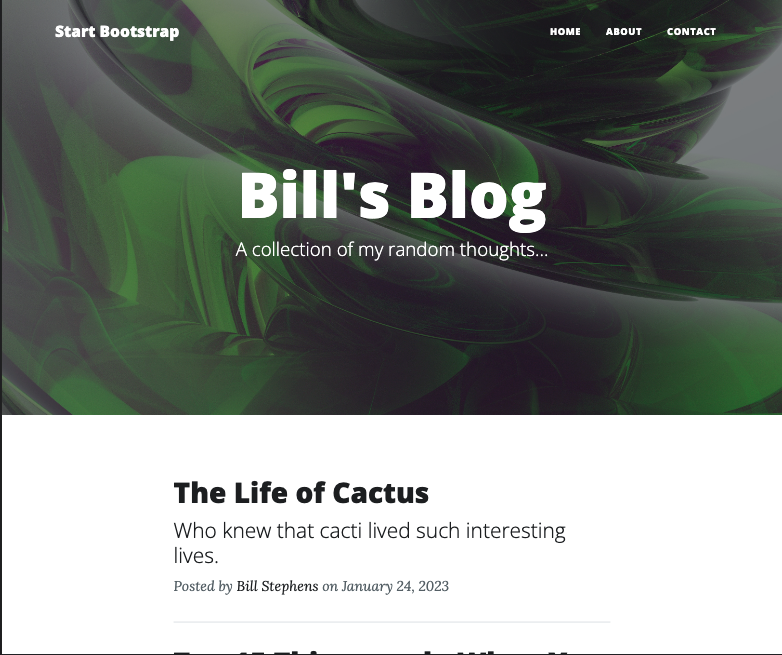

# Blog-Python-Flask 

  ## Description

  This is a simple blog app built using Flask and styled with Bootstrap. This blog has a homepage displaying posts that are retrieved 
  rom the npoint API, an about page, and a contact page.  When a user clicks on the post title, the app will render the actual post including 
  all of the text and  an image from the blog post.

Screenshots below:

  
  ## Table of Contents
  
  - [Installation](#installation)
  - [Usage](#usage)
  - [License](#license)
  - [Contributing](#contributing)
  - [Tests](#tests)
  - [Questions](#questions)
  
  ## Installation
  
  run main.py in terminal and go to localhost://5000.
  
  ## Usage
  
  Click on navbar items or individual posts to navigate around the site.

  ## License
This application is covered under the MIT License.
 For more information: https://opensource.org/licenses/MIT
  
  ## Contributing
  N/A
  
  ## Tests
  N/A

  ## Questions
  Contact Info 
  GitHub user name: BillStephens2022 
  Link to GitHub profile: https://github.com/BillStephens2022 
  Email: stephensbill17@gmail.com